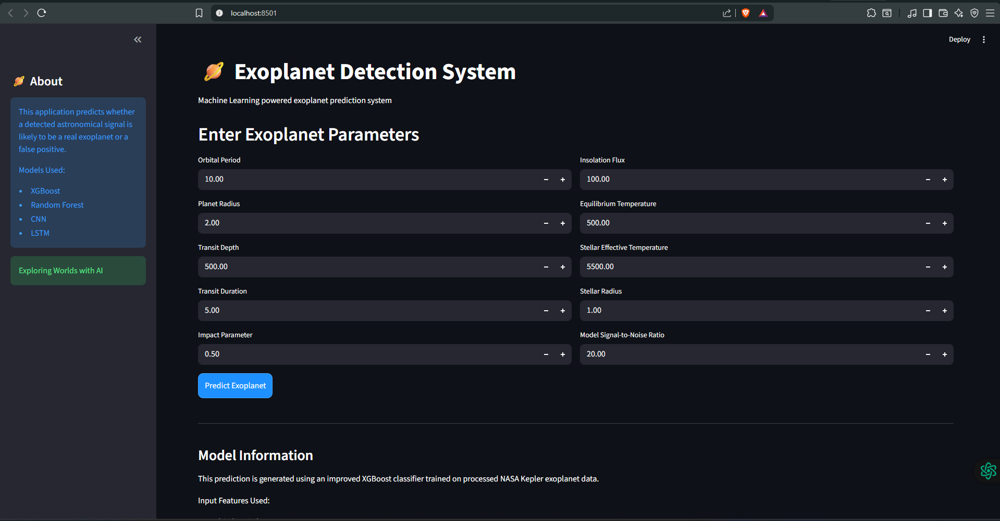
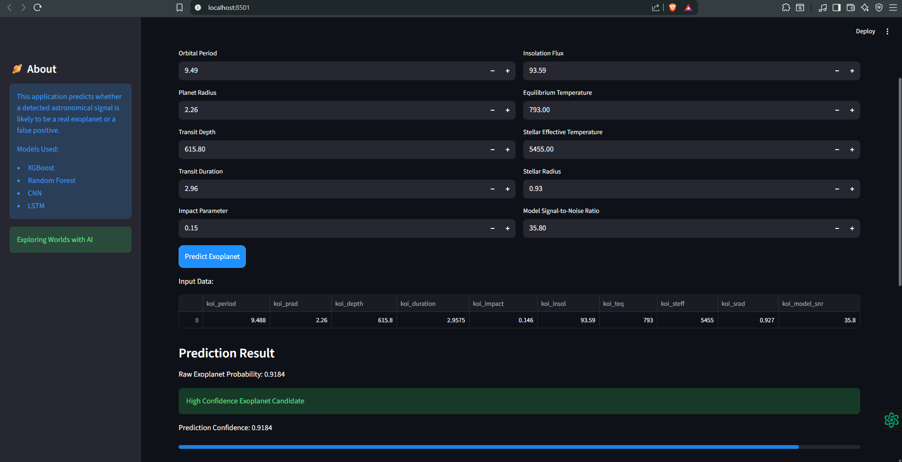
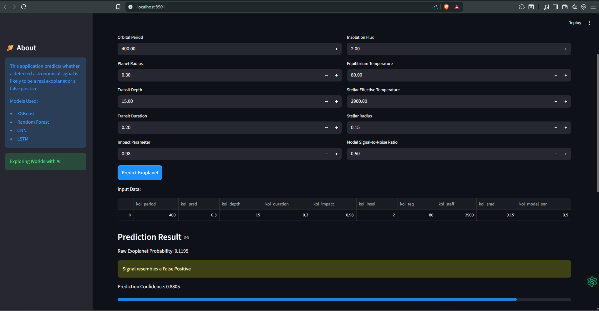
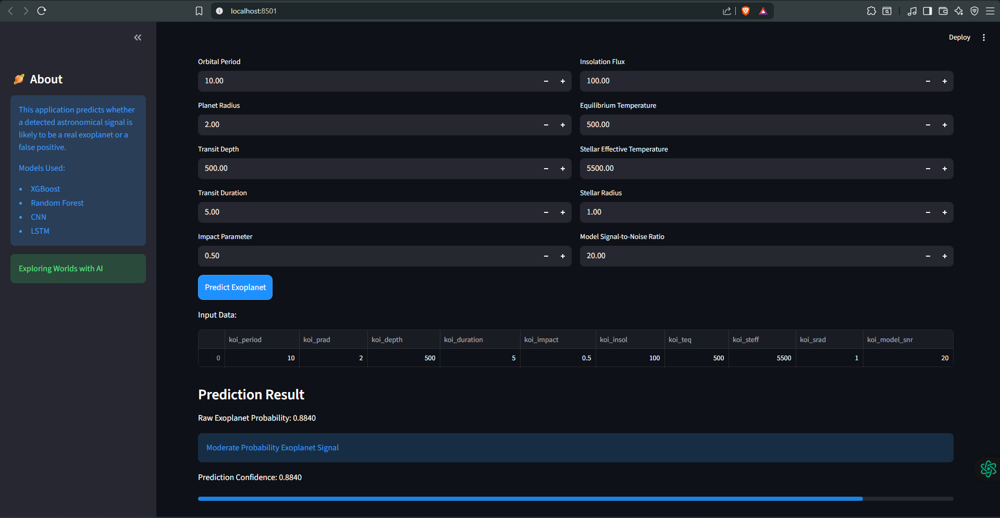
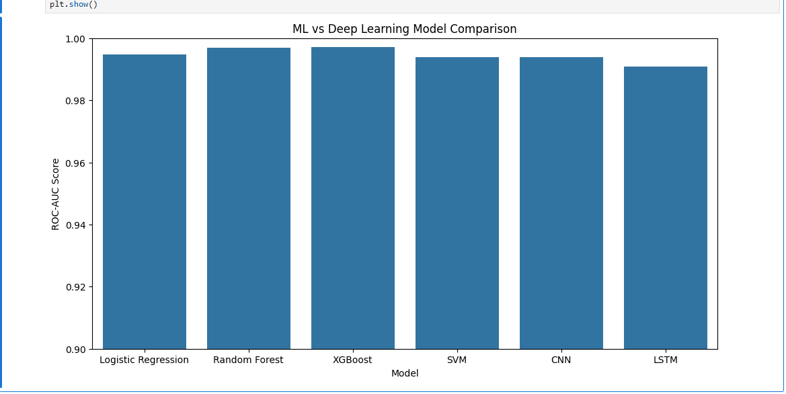

# Exoplanet Detection System

An end-to-end Machine Learning and Deep Learning project that predicts whether an astronomical signal is likely to represent a real exoplanet or a false positive using NASA Kepler dataset features.

The project combines data preprocessing, feature engineering, machine learning, deep learning experimentation, and deployment into an interactive Streamlit web application.

---
# Features

* End-to-end Machine Learning pipeline
* Data preprocessing and feature engineering
* Missing value handling and scaling
* SMOTE-based class balancing
* Multiple Machine Learning models
* Deep Learning experimentation
* Model comparison using ROC-AUC
* Interactive Streamlit web application
* Confidence-based prediction system
* Astronomical parameter analysis
* Real-time prediction interface

---

# Technologies Used

## Programming Language

* Python

## Libraries & Frameworks

* Pandas
* NumPy
* Scikit-learn
* XGBoost
* TensorFlow
* Keras
* Streamlit
* Matplotlib
* Seaborn
* Joblib

---

# Models Implemented

| Model               | Purpose                             |
| ------------------- | ----------------------------------- |
| Logistic Regression | Baseline classification             |
| Random Forest       | Ensemble learning                   |
| XGBoost             | Final deployed model                |
| CNN                 | Deep Learning experimentation       |
| LSTM                | Sequential learning experimentation |

---

# Input Features Used

The deployed model uses the following astronomical parameters:

* Orbital Period
* Planet Radius
* Transit Depth
* Transit Duration
* Impact Parameter
* Insolation Flux
* Equilibrium Temperature
* Stellar Effective Temperature
* Stellar Radius
* Model Signal-to-Noise Ratio

These features help the model analyze planetary transit patterns and stellar characteristics to determine whether the detected signal resembles a potential exoplanet candidate or a false positive.

---

# Screenshots

## Home Interface



---

## High Confidence Prediction



---

## False Positive Detection



---

## Moderate Probability Detection



---

## Model Comparison Graph



---

# Installation & Setup

## Clone the Repository

```bash
git clone https://github.com/shreya2334/Exoplanet-Detection-System.git
```

---

## Navigate to the Project Folder

```bash
cd Exoplanet-Detection
```

---

## Create Conda Environment (Optional)

```bash
conda create -n exoplanet-env python=3.10
```

Activate the environment:

```bash
conda activate exoplanet-env
```

---

## Install Dependencies

```bash
pip install -r requirements.txt
```

---

## Run the Streamlit Application

```bash
streamlit run app/streamlit_app.py
```
---

# Project Workflow

## Data Collection

* NASA Kepler dataset acquisition

## Exploratory Data Analysis

* Data understanding
* Visualization
* Correlation analysis

## Data Preprocessing

* Missing value handling
* Feature selection
* Feature scaling
* SMOTE oversampling

## Model Training

* Logistic Regression
* Random Forest
* XGBoost
* CNN
* LSTM

## Model Evaluation

* ROC-AUC comparison
* Accuracy evaluation
* Probability analysis

## Deployment

* Streamlit web application
* Real-time inference
* Confidence-based predictions

---

# Challenges Faced

During development, several real-world Machine Learning deployment issues were encountered and resolved:

* Feature mismatch during deployment
* Scaling inconsistencies between training and inference
* Model overconfidence
* Threshold calibration
* Balancing prediction quality with deployment simplicity

These debugging steps helped improve the realism and reliability of the final deployed system.

---

# Future Improvements

* Raw Kepler light curve analysis
* Explainable AI visualizations
* Probability calibration techniques
* Cloud deployment
* Real-time astronomy data integration
* Advanced astrophysical feature engineering

---

# Key Learnings

* End-to-end Machine Learning workflow
* Feature engineering techniques
* Model evaluation and comparison
* Deployment debugging
* Scaling consistency in inference pipelines
* Streamlit application development
* Confidence calibration in ML systems

---

# Author

Shreya Jadhav

Exploring distant worlds with Artificial Intelligence 
